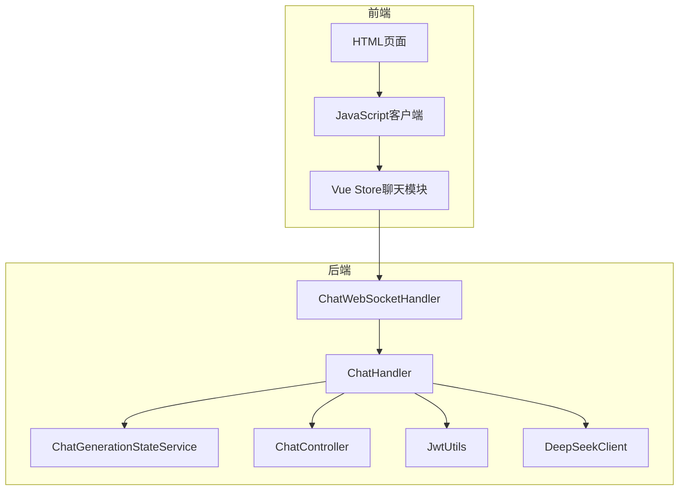
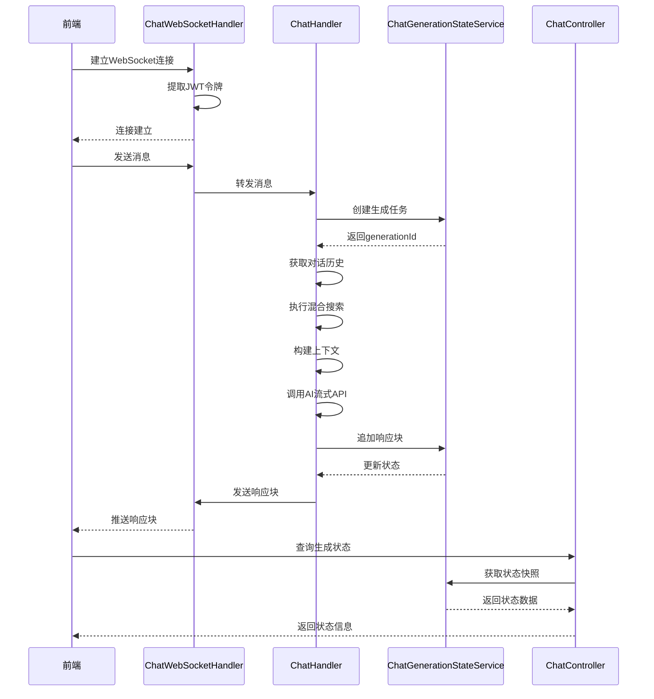
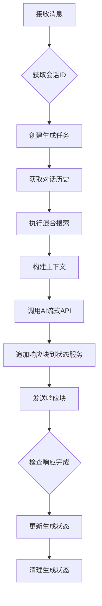
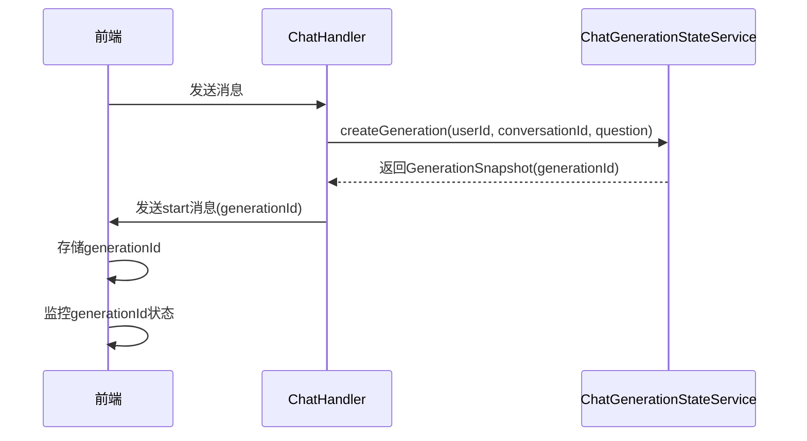
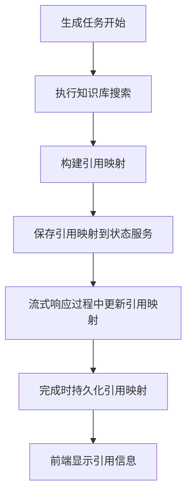
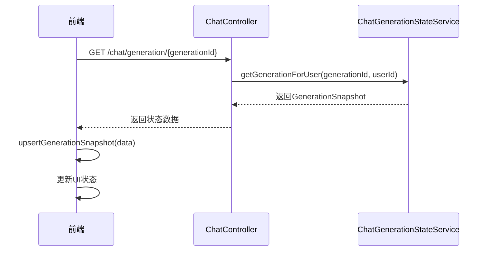
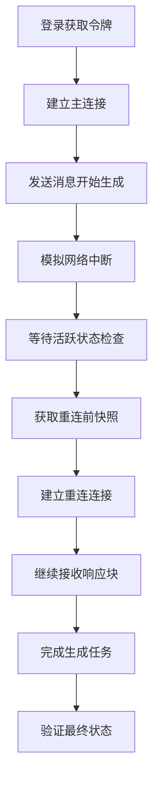
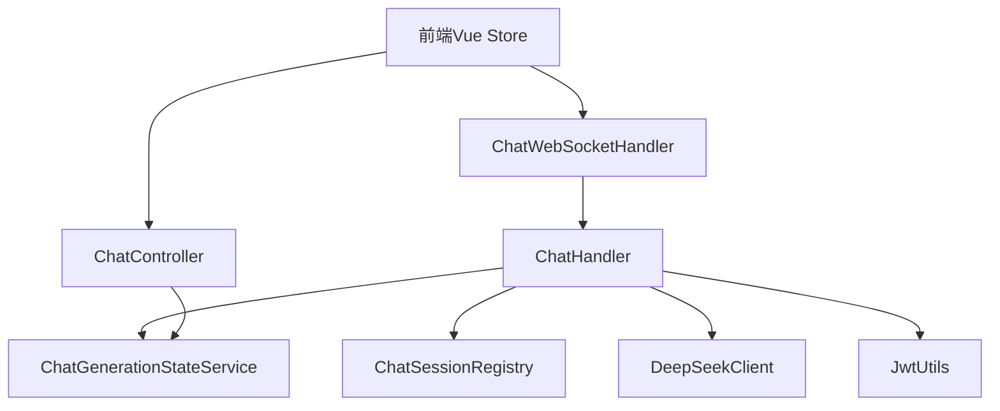

# WebSocket聊天API

<cite>
**本文档引用的文件**   
- [ChatGenerationStateService.java](file://src/main/java/com/yizhaoqi/smartpai/service/ChatGenerationStateService.java)
- [ChatWebSocketHandler.java](file://src/main/java/com/yizhaoqi/smartpai/handler/ChatWebSocketHandler.java)
- [ChatHandler.java](file://src/main/java/com/yizhaoqi/smartpai/service/ChatHandler.java)
- [ChatController.java](file://src/main/java/com/yizhaoqi/smartpai/controller/ChatController.java)
- [JwtUtils.java](file://src/main/java/com/yizhaoqi/smartpai/utils/JwtUtils.java)
- [index.ts](file://frontend/src/store/modules/chat/index.ts)
- [chat-reconnect-smoke-test.mjs](file://scripts/chat-reconnect-smoke-test.mjs)
- [test.html](file://src/main/resources/static/test.html)
</cite>

## 更新摘要
**变更内容**   
- 新增聊天生成状态管理功能章节
- 更新消息帧结构，包含generationId和状态字段
- 新增断线重连恢复机制说明
- 增加引用映射管理和状态映射功能
- 更新前端连接与消息处理示例

## 目录
1. [简介](#简介)
2. [项目结构](#项目结构)
3. [核心组件](#核心组件)
4. [架构概述](#架构概述)
5. [详细组件分析](#详细组件分析)
6. [聊天生成状态管理](#聊天生成状态管理)
7. [断线重连恢复机制](#断线重连恢复机制)
8. [依赖分析](#依赖分析)
9. [性能考虑](#性能考虑)
10. [故障排除指南](#故障排除指南)
11. [结论](#结论)

## 简介
本文档详细描述了基于WebSocket的实时聊天API实现。系统通过WebSocket协议实现客户端与服务端的双向实时通信，支持流式AI响应生成。前端使用原生WebSocket连接，后端基于Spring WebSocket实现消息处理。认证机制采用JWT令牌，通过Redis进行令牌状态管理。系统实现了完整的连接生命周期管理、心跳检测、错误处理、消息序列化机制以及先进的聊天生成状态管理功能。

## 项目结构
项目采用前后端分离架构，前端位于`frontend`目录，后端位于`src/main`目录。后端使用Spring Boot框架，WebSocket处理器位于`handler`包，业务逻辑在`service`包，AI客户端在`client`包，状态管理在`service`包新增的`ChatGenerationStateService`中。前端静态资源位于`src/main/resources/static`目录，包含完整的WebSocket连接和消息处理逻辑。



**图示来源**
- [test.html](file://src/main/resources/static/test.html)
- [ChatWebSocketHandler.java](file://src/main/java/com/yizhaoqi/smartpai/handler/ChatWebSocketHandler.java)
- [ChatGenerationStateService.java](file://src/main/java/com/yizhaoqi/smartpai/service/ChatGenerationStateService.java)

## 核心组件
系统核心组件包括WebSocket处理器、聊天处理服务、聊天生成状态服务、控制器和JWT工具类。WebSocket处理器负责连接管理，聊天处理服务协调消息处理流程，聊天生成状态服务管理生成任务的生命周期和状态，控制器提供REST API接口，JWT工具类处理认证和令牌管理。这些组件通过依赖注入紧密协作，实现完整的聊天功能。

**组件来源**
- [ChatWebSocketHandler.java:15-181](file://src/main/java/com/yizhaoqi/smartpai/handler/ChatWebSocketHandler.java#L15-L181)
- [ChatHandler.java:34-82](file://src/main/java/com/yizhaoqi/smartpai/service/ChatHandler.java#L34-L82)
- [ChatGenerationStateService.java:17-31](file://src/main/java/com/yizhaoqi/smartpai/service/ChatGenerationStateService.java#L17-L31)

## 架构概述
系统采用分层架构，前端通过WebSocket连接后端，后端各组件职责分明。连接建立时，通过JWT令牌认证用户身份。消息处理时，系统检索相关知识库，构建上下文，调用AI模型生成流式响应。整个流程通过WebSocket实时推送给前端。新增的聊天生成状态管理系统提供了完整的生成任务生命周期管理。



**图示来源**
- [ChatWebSocketHandler.java](file://src/main/java/com/yizhaoqi/smartpai/handler/ChatWebSocketHandler.java)
- [ChatHandler.java](file://src/main/java/com/yizhaoqi/smartpai/service/ChatHandler.java)
- [ChatGenerationStateService.java](file://src/main/java/com/yizhaoqi/smartpai/service/ChatGenerationStateService.java)
- [ChatController.java](file://src/main/java/com/yizhaoqi/smartpai/controller/ChatController.java)

## 详细组件分析

### WebSocket连接建立与认证
系统通过在WebSocket连接URL中传递JWT令牌实现认证。前端登录后获取令牌，将其作为路径参数建立连接。服务端从连接路径提取令牌，通过JwtUtils验证用户身份。

```javascript
// 前端连接代码
ws = new WebSocket(`ws://localhost:8081/chat/${token}`);

// 服务端提取用户ID
private String extractUserId(WebSocketSession session) {
    String path = session.getUri().getPath();
    String[] segments = path.split("/");
    String jwtToken = segments[segments.length - 1];
    return jwtUtils.extractUsernameFromToken(jwtToken);
}
```

**代码来源**
- [test.html:537-564](file://src/main/resources/static/test.html#L537-L564)
- [ChatWebSocketHandler.java:145-153](file://src/main/java/com/yizhaoqi/smartpai/handler/ChatWebSocketHandler.java#L145-L153)

### 消息帧结构与序列化
消息通过JSON格式传输，包含多种类型的消息帧。响应块包含`chunk`字段，完成通知包含`type`和`status`字段，启动通知包含`generationId`和`conversationId`。前后端使用标准JSON序列化，确保数据格式一致。

```json
// 连接建立通知
{
  "type": "connection",
  "sessionId": "session-id",
  "message": "WebSocket连接已建立"
}

// 生成任务启动
{
  "type": "start",
  "generationId": "uuid-generate",
  "conversationId": "conversation-id",
  "timestamp": 1640995200000
}

// 响应块
{
  "type": "chunk",
  "generationId": "uuid-generate",
  "conversationId": "conversation-id",
  "chunk": "这是AI回复的一部分"
}

// 完成通知
{
  "type": "completion",
  "generationId": "uuid-generate",
  "conversationId": "conversation-id",
  "status": "finished",
  "message": "响应已完成",
  "timestamp": 1640995200000,
  "date": "2022-01-01T00:00:00"
}

// 错误通知
{
  "type": "error",
  "generationId": "uuid-generate",
  "error": "AI服务暂时不可用，请稍后重试"
}
```

**代码来源**
- [test.html:565-585](file://src/main/resources/static/test.html#L565-L585)
- [ChatHandler.java:454-496](file://src/main/java/com/yizhaoqi/smartpai/service/ChatHandler.java#L454-L496)

### 服务端消息处理机制
ChatHandler是核心处理组件，负责协调整个消息处理流程。它获取对话历史，执行知识库搜索，构建AI请求上下文，并处理流式响应。新增的聊天生成状态管理功能确保每个生成任务都有唯一的标识符和完整的状态跟踪。



**图示来源**
- [ChatHandler.java:84-160](file://src/main/java/com/yizhaoqi/smartpai/service/ChatHandler.java#L84-L160)

### AI模型流式响应实现
DeepSeekClient使用WebClient实现流式API调用，通过bodyToFlux将响应分解为数据块，逐个处理并推送给前端。每个响应块都会更新聊天生成状态服务中的内容。

```java
public void streamResponse(String userMessage, 
                         String context,
                         List<Map<String, String>> history,
                         Consumer<String> onChunk,
                         Consumer<Throwable> onError) {
    
    Map<String, Object> request = buildRequest(userMessage, context, history);
    
    webClient.post()
            .uri("/chat/completions")
            .contentType(MediaType.APPLICATION_JSON)
            .bodyValue(request)
            .retrieve()
            .bodyToFlux(String.class)
            .subscribe(onChunk, onError);
}
```

**代码来源**
- [DeepSeekClient.java:30-50](file://src/main/java/com/yizhaoqi/smartpai/client/DeepSeekClient.java#L30-L50)

### 心跳检测与连接保活
系统通过前端重连机制实现连接保活。当连接意外关闭时，前端会指数退避重试，最大重试5次，每次间隔逐渐增加。新增的心跳机制支持`__chat_ping__`和`__chat_pong__`消息类型。

```javascript
ws.onclose = function(event) {
    if (!intentionalClosure && event.code !== 1000 && reconnectAttempts < maxReconnectAttempts) {
        const timeout = Math.min(1000 * Math.pow(2, reconnectAttempts), 30000);
        setTimeout(() => {
            reconnectAttempts++;
            initializeWebSocket();
        }, timeout);
    }
};
```

**代码来源**
- [test.html:545-558](file://src/main/resources/static/test.html#L545-L558)

### 前端连接与消息发送示例
前端使用原生WebSocket API实现连接和消息交互，包含完整的错误处理和状态管理。新增的Vue Store聊天模块提供了更高级的状态管理功能。

```javascript
// 建立连接
function initializeWebSocket() {
    ws = new WebSocket(`ws://localhost:8081/chat/${token}`);
    
    ws.onopen = function() {
        updateConnectionStatus(true);
    };

    ws.onmessage = function(event) {
        const response = JSON.parse(event.data);
        if (response.chunk) {
            updateLastMessage(currentAssistantMessage + response.chunk);
        }
    };
}

// 发送消息
function sendMessage() {
    if (ws.readyState === WebSocket.OPEN) {
        ws.send(message);
    }
}
```

**代码来源**
- [test.html:530-642](file://src/main/resources/static/test.html#L530-L642)

## 聊天生成状态管理

### generationId跟踪机制
系统为每个聊天生成任务分配唯一的generationId，确保每个对话都有明确的标识符。这个ID贯穿整个生成过程，从创建到完成，用于状态跟踪和断线重连恢复。



**图示来源**
- [ChatHandler.java:93-99](file://src/main/java/com/yizhaoqi/smartpai/service/ChatHandler.java#L93-L99)
- [ChatGenerationStateService.java:33-43](file://src/main/java/com/yizhaoqi/smartpai/service/ChatGenerationStateService.java#L33-L43)

### 状态映射与转换
系统实现了后端GenerationStatus枚举与前端消息状态的映射机制。后端状态包括STREAMING、COMPLETED、FAILED、CANCELLED，前端状态映射为pending、loading、finished、error。

```typescript
function mapGenerationStatus(status?: Api.Chat.GenerationStatus): Api.Chat.Message['status'] {
    if (status === 'COMPLETED' || status === 'CANCELLED') {
      return 'finished';
    }
    if (status === 'FAILED') {
      return 'error';
    }
    if (status === 'STREAMING') {
      return 'loading';
    }
    return 'pending';
  }
```

**代码来源**
- [index.ts:25-36](file://frontend/src/store/modules/chat/index.ts#L25-L36)

### 引用映射管理
系统支持知识库引用的映射管理，将生成过程中的引用编号与具体的文件信息关联起来。这使得用户可以看到AI回答的引用来源。



**图示来源**
- [ChatHandler.java:447-449](file://src/main/java/com/yizhaoqi/smartpai/service/ChatHandler.java#L447-L449)
- [ChatGenerationStateService.java:55-70](file://src/main/java/com/yizhaoqi/smartpai/service/ChatGenerationStateService.java#L55-L70)

**章节来源**
- [ChatGenerationStateService.java:17-267](file://src/main/java/com/yizhaoqi/smartpai/service/ChatGenerationStateService.java#L17-L267)
- [ChatHandler.java:447-449](file://src/main/java/com/yizhaoqi/smartpai/service/ChatHandler.java#L447-L449)
- [index.ts:25-36](file://frontend/src/store/modules/chat/index.ts#L25-L36)

## 断线重连恢复机制

### 重连同步流程
系统提供了完整的断线重连恢复机制，允许用户在网络中断后继续之前的聊天会话。前端通过API接口获取生成状态快照，自动恢复聊天界面状态。



**图示来源**
- [ChatController.java:58-86](file://src/main/java/com/yizhaoqi/smartpai/controller/ChatController.java#L58-L86)
- [ChatGenerationStateService.java:84-93](file://src/main/java/com/yizhaoqi/smartpai/service/ChatGenerationStateService.java#L84-L93)

### 重连状态同步
前端实现了智能的状态同步机制，能够根据当前的generationId或活跃生成任务来恢复聊天状态。

```typescript
async function syncGenerationAfterReconnect() {
    const pendingGenerationId = getPendingGenerationId();
    if (pendingGenerationId) {
      upsertGenerationSnapshot(await fetchGenerationSnapshot(pendingGenerationId));
      return;
    }

    upsertGenerationSnapshot(await fetchActiveGenerationSnapshot());
  }
```

**代码来源**
- [index.ts:135-143](file://frontend/src/store/modules/chat/index.ts#L135-L143)

### 重连测试脚本
系统提供了完整的重连测试脚本，模拟网络中断场景下的恢复过程，确保系统的可靠性。



**图示来源**
- [chat-reconnect-smoke-test.mjs:119-191](file://scripts/chat-reconnect-smoke-test.mjs#L119-L191)

**章节来源**
- [ChatController.java:58-86](file://src/main/java/com/yizhaoqi/smartpai/controller/ChatController.java#L58-L86)
- [index.ts:135-143](file://frontend/src/store/modules/chat/index.ts#L135-L143)
- [chat-reconnect-smoke-test.mjs:119-354](file://scripts/chat-reconnect-smoke-test.mjs#L119-L354)

## 依赖分析
系统组件间依赖关系清晰，遵循依赖倒置原则。高层组件依赖抽象，具体实现通过Spring容器注入。WebSocket处理器依赖聊天处理服务，聊天处理服务依赖聊天生成状态服务、聊天会话注册表、AI客户端和JWT工具类。



**图示来源**
- [ChatWebSocketHandler.java](file://src/main/java/com/yizhaoqi/smartpai/handler/ChatWebSocketHandler.java)
- [ChatHandler.java](file://src/main/java/com/yizhaoqi/smartpai/service/ChatHandler.java)
- [ChatController.java](file://src/main/java/com/yizhaoqi/smartpai/controller/ChatController.java)

## 性能考虑
系统在性能方面做了多项优化：使用Redis缓存对话历史，避免频繁数据库访问；流式响应减少用户等待时间；连接复用避免频繁握手；聊天生成状态服务使用Redis原子操作确保数据一致性；断线重连机制减少用户等待时间。AI响应处理使用异步线程，避免阻塞WebSocket事件循环。

## 故障排除指南
常见问题及解决方案：

1. **连接失败**：检查JWT令牌是否有效，确保登录成功后获取令牌
2. **消息乱序**：系统使用单个WebSocket连接，正常情况下不会出现乱序
3. **网络延迟**：检查AI服务响应时间，优化知识库搜索性能
4. **连接中断**：前端有重连机制，检查网络状况和服务器负载
5. **生成状态异常**：检查Redis连接状态，确认生成任务状态一致性
6. **引用映射丢失**：验证引用映射的序列化和反序列化过程

**问题来源**
- [test.html:545-558](file://src/main/resources/static/test.html#L545-L558)
- [ChatHandler.java:200-250](file://src/main/java/com/yizhaoqi/smartpai/service/ChatHandler.java#L200-L250)

## 结论
本WebSocket聊天API实现了完整的实时通信功能，具有良好的架构设计和错误处理机制。系统通过流式响应提供流畅的用户体验，通过JWT认证确保安全性，通过Redis缓存提升性能。新增的聊天生成状态管理功能提供了完整的生成任务生命周期管理，包括generationId跟踪、状态映射和断线重连恢复机制。整体实现稳定可靠，可扩展性强，为复杂的AI聊天应用提供了坚实的技术基础。