# 聊天生成状态管理

<cite>
**本文档引用的文件**
- [ChatGenerationStateService.java](file://src/main/java/com/yizhaoqi/smartpai/service/ChatGenerationStateService.java)
- [ChatWebSocketHandler.java](file://src/main/java/com/yizhaoqi/smartpai/handler/ChatWebSocketHandler.java)
- [ChatController.java](file://src/main/java/com/yizhaoqi/smartpai/controller/ChatController.java)
- [ChatHandler.java](file://src/main/java/com/yizhaoqi/smartpai/service/ChatHandler.java)
- [ChatSessionRegistry.java](file://src/main/java/com/yizhaoqi/smartpai/service/ChatSessionRegistry.java)
- [index.ts](file://frontend/src/store/modules/chat/index.ts)
- [input-box.vue](file://frontend/src/views/chat/modules/input-box.vue)
- [chat-message.vue](file://frontend/src/views/chat/modules/chat-message.vue)
- [index.vue](file://frontend/src/views/chat/index.vue)
- [application.yml](file://src/main/resources/application.yml)
- [Conversation.java](file://src/main/java/com/yizhaoqi/smartpai/model/Conversation.java)
- [api.d.ts](file://frontend/src/typings/api.d.ts)
</cite>

## 目录
1. [简介](#简介)
2. [项目结构](#项目结构)
3. [核心组件](#核心组件)
4. [架构概览](#架构概览)
5. [详细组件分析](#详细组件分析)
6. [依赖关系分析](#依赖关系分析)
7. [性能考虑](#性能考虑)
8. [故障排除指南](#故障排除指南)
9. [结论](#结论)

## 简介

聊天生成状态管理系统是一个基于Spring Boot和Vue.js构建的实时聊天应用，专注于提供流畅的AI对话体验。该系统通过Redis实现分布式状态管理，支持流式响应、引用溯源、速率限制和会话恢复等高级功能。

系统采用前后端分离架构，后端使用Java Spring Boot框架，前端使用Vue 3 + TypeScript，通过WebSocket实现实时通信。核心特性包括：

- 实时流式响应生成
- 分布式会话状态管理
- 引用溯源和证据展示
- 速率限制和负载保护
- 自动重连和状态同步
- 停止生成控制

## 项目结构

该项目采用标准的Maven多模块结构，主要分为后端服务和前端应用两大部分：

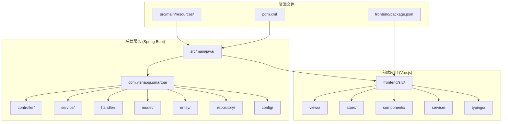

**图表来源**
- [ChatGenerationStateService.java:1-268](file://src/main/java/com/yizhaoqi/smartpai/service/ChatGenerationStateService.java#L1-L268)
- [index.ts:1-342](file://frontend/src/store/modules/chat/index.ts#L1-L342)

**章节来源**
- [ChatGenerationStateService.java:1-268](file://src/main/java/com/yizhaoqi/smartpai/service/ChatGenerationStateService.java#L1-L268)
- [index.ts:1-342](file://frontend/src/store/modules/chat/index.ts#L1-L342)

## 核心组件

### 后端核心组件

系统的核心由以下关键组件构成：

1. **ChatGenerationStateService**: 分布式状态管理服务
2. **ChatHandler**: 聊天处理和业务逻辑协调者
3. **ChatWebSocketHandler**: WebSocket连接和消息处理
4. **ChatSessionRegistry**: 会话注册表管理
5. **ChatController**: REST API控制器

### 前端核心组件

前端应用的核心组件包括：

1. **聊天状态管理 (useChatStore)**: Vuex Store实现
2. **输入框组件 (InputBox)**: 用户交互界面
3. **消息显示组件 (ChatMessage)**: 实时消息渲染
4. **聊天列表组件**: 消息历史展示

**章节来源**
- [ChatGenerationStateService.java:17-268](file://src/main/java/com/yizhaoqi/smartpai/service/ChatGenerationStateService.java#L17-L268)
- [ChatHandler.java:34-82](file://src/main/java/com/yizhaoqi/smartpai/service/ChatHandler.java#L34-L82)
- [index.ts:4-342](file://frontend/src/store/modules/chat/index.ts#L4-L342)

## 架构概览

系统采用分层架构设计，实现了清晰的关注点分离：

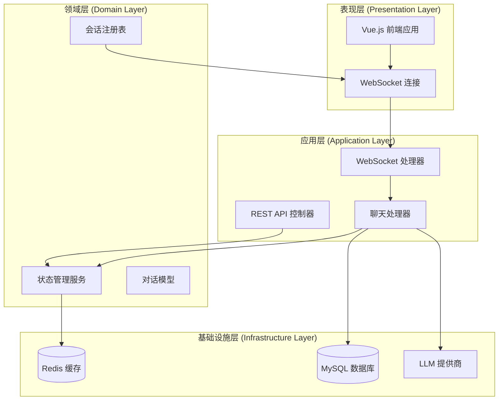

**图表来源**
- [ChatWebSocketHandler.java:16-35](file://src/main/java/com/yizhaoqi/smartpai/handler/ChatWebSocketHandler.java#L16-L35)
- [ChatHandler.java:34-82](file://src/main/java/com/yizhaoqi/smartpai/service/ChatHandler.java#L34-L82)
- [ChatGenerationStateService.java:17-31](file://src/main/java/com/yizhaoqi/smartpai/service/ChatGenerationStateService.java#L17-L31)

## 详细组件分析

### ChatGenerationStateService - 分布式状态管理

该服务是整个聊天系统的核心状态管理组件，负责维护生成过程的完整生命周期：

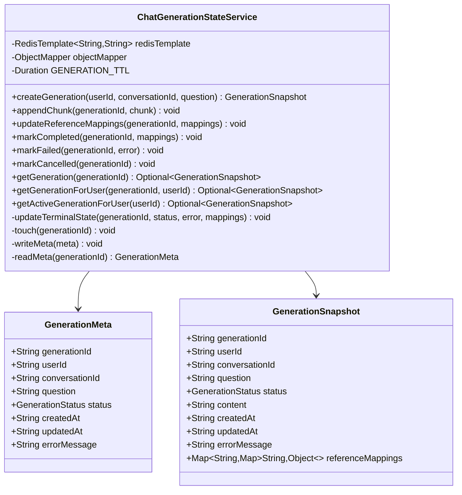

**图表来源**
- [ChatGenerationStateService.java:235-267](file://src/main/java/com/yizhaoqi/smartpai/service/ChatGenerationStateService.java#L235-L267)

#### 状态管理流程

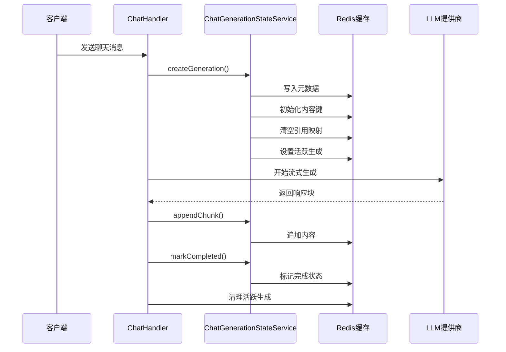

**图表来源**
- [ChatHandler.java:84-160](file://src/main/java/com/yizhaoqi/smartpai/service/ChatHandler.java#L84-L160)
- [ChatGenerationStateService.java:33-135](file://src/main/java/com/yizhaoqi/smartpai/service/ChatGenerationStateService.java#L33-L135)

**章节来源**
- [ChatGenerationStateService.java:17-268](file://src/main/java/com/yizhaoqi/smartpai/service/ChatGenerationStateService.java#L17-L268)

### ChatHandler - 聊天处理协调器

ChatHandler是系统的核心业务逻辑组件，负责协调整个聊天流程：

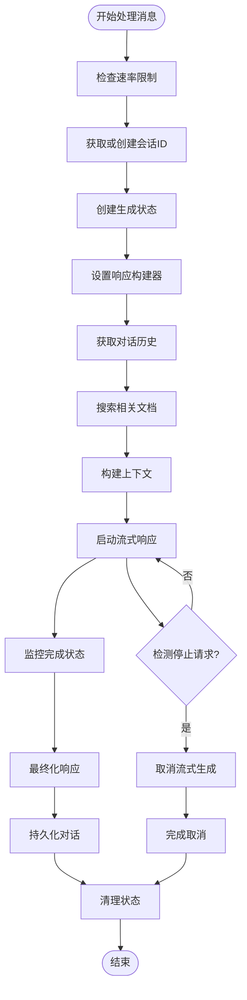

**图表来源**
- [ChatHandler.java:84-247](file://src/main/java/com/yizhaoqi/smartpai/service/ChatHandler.java#L84-L247)

#### 引用溯源机制

系统实现了完整的引用溯源功能，支持将AI回答与原始文档建立关联：

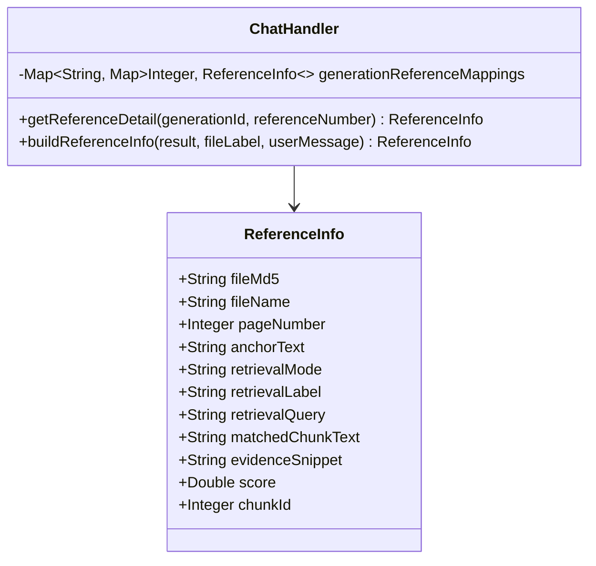

**图表来源**
- [ChatHandler.java:689-702](file://src/main/java/com/yizhaoqi/smartpai/service/ChatHandler.java#L689-L702)

**章节来源**
- [ChatHandler.java:34-704](file://src/main/java/com/yizhaoqi/smartpai/service/ChatHandler.java#L34-L704)

### 前端状态管理 (useChatStore)

前端使用Vuex Store模式实现状态管理，提供响应式的聊天体验：

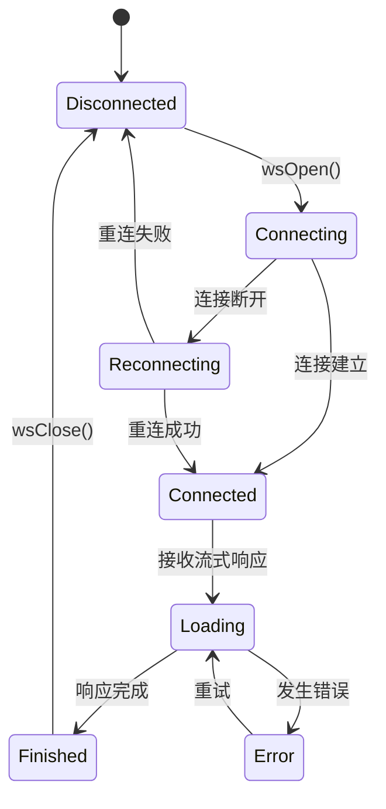

**图表来源**
- [index.ts:309-319](file://frontend/src/store/modules/chat/index.ts#L309-L319)

#### WebSocket通信流程

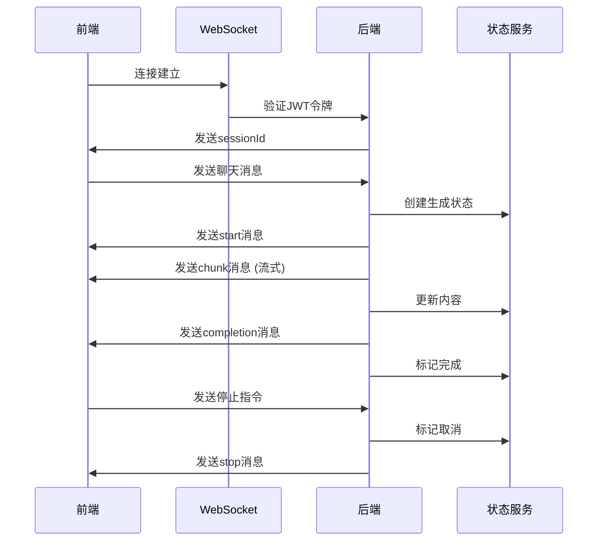

**图表来源**
- [index.ts:155-201](file://frontend/src/store/modules/chat/index.ts#L155-L201)
- [input-box.vue:179-217](file://frontend/src/views/chat/modules/input-box.vue#L179-L217)

**章节来源**
- [index.ts:1-342](file://frontend/src/store/modules/chat/index.ts#L1-L342)
- [input-box.vue:1-282](file://frontend/src/views/chat/modules/input-box.vue#L1-L282)

### 数据模型设计

系统使用JPA实体模型管理对话历史：

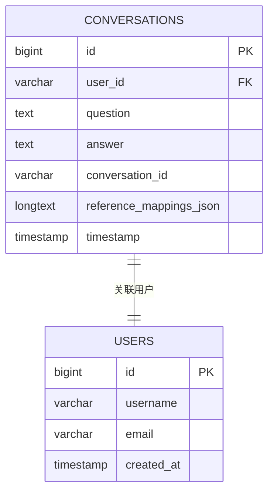

**图表来源**
- [Conversation.java:16-40](file://src/main/java/com/yizhaoqi/smartpai/model/Conversation.java#L16-L40)

**章节来源**
- [Conversation.java:1-41](file://src/main/java/com/yizhaoqi/smartpai/model/Conversation.java#L1-L41)

## 依赖关系分析

系统各组件之间的依赖关系如下：

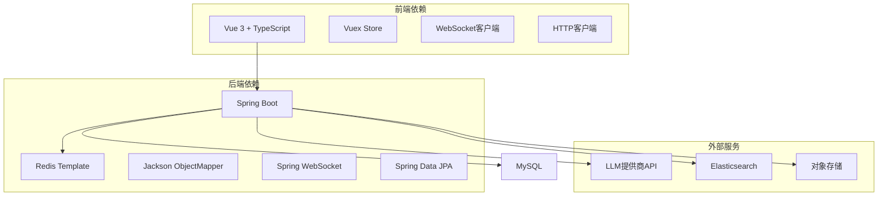

**图表来源**
- [ChatGenerationStateService.java:3-31](file://src/main/java/com/yizhaoqi/smartpai/service/ChatGenerationStateService.java#L3-L31)
- [application.yml:1-230](file://src/main/resources/application.yml#L1-L230)

**章节来源**
- [application.yml:1-230](file://src/main/resources/application.yml#L1-L230)

## 性能考虑

### Redis优化策略

系统采用Redis作为主要缓存层，通过合理的键命名规范和TTL管理实现高性能：

1. **键命名规范**: 使用`chat:generation:{id}:{type}`的统一格式
2. **TTL管理**: 默认30分钟过期时间，自动清理过期数据
3. **内存优化**: 分离存储元数据、内容和引用映射

### 流式响应优化

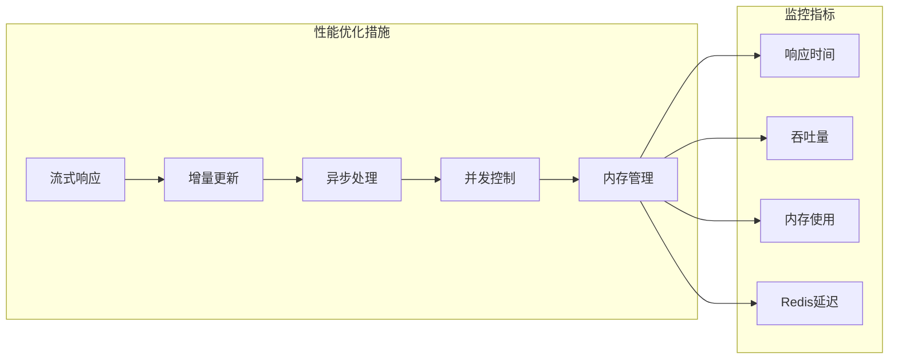

### 速率限制机制

系统实现了多层次的速率限制：

1. **用户级别限制**: 每用户每分钟最多30次消息
2. **全局限制**: LLM请求的分钟级和天级限制
3. **嵌入向量限制**: 独立的嵌入请求限制

**章节来源**
- [application.yml:96-116](file://src/main/resources/application.yml#L96-L116)

## 故障排除指南

### 常见问题及解决方案

#### WebSocket连接问题

| 问题症状 | 可能原因 | 解决方案 |
|---------|---------|---------|
| 连接频繁断开 | 网络不稳定 | 检查防火墙设置，启用自动重连 |
| 鉴权失败 | JWT令牌过期 | 重新登录获取新令牌 |
| 心跳超时 | 服务器负载过高 | 降低并发连接数 |

#### 状态同步问题

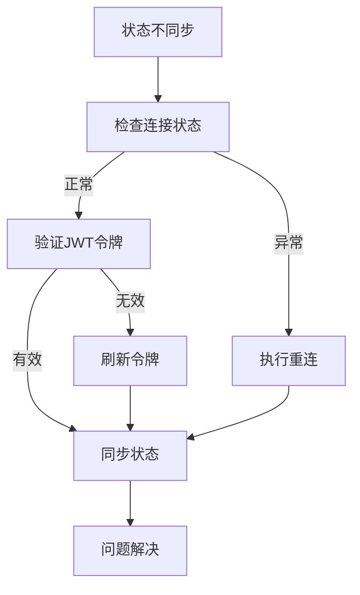

#### 引用溯源问题

1. **引用编号缺失**: 检查`generationReferenceMappings`映射
2. **文件MD5不匹配**: 验证文档存储和索引完整性
3. **证据片段为空**: 检查检索结果和文本截取逻辑

**章节来源**
- [index.ts:184-200](file://frontend/src/store/modules/chat/index.ts#L184-L200)
- [ChatHandler.java:567-599](file://src/main/java/com/yizhaoqi/smartpai/service/ChatHandler.java#L567-L599)

### 日志和监控

系统提供了详细的日志记录和错误处理机制：

1. **连接日志**: 记录WebSocket连接建立和断开事件
2. **处理日志**: 跟踪消息处理和状态变更
3. **错误日志**: 记录异常情况和故障恢复

**章节来源**
- [ChatWebSocketHandler.java:37-74](file://src/main/java/com/yizhaoqi/smartpai/handler/ChatWebSocketHandler.java#L37-L74)
- [ChatHandler.java:498-505](file://src/main/java/com/yizhaoqi/smartpai/service/ChatHandler.java#L498-L505)

## 结论

聊天生成状态管理系统通过精心设计的架构和实现，成功解决了实时聊天应用中的核心挑战。系统的主要优势包括：

1. **高可靠性**: 基于Redis的分布式状态管理确保了状态的一致性和持久性
2. **高性能**: 流式响应和异步处理提供了流畅的用户体验
3. **可扩展性**: 模块化的架构设计便于功能扩展和维护
4. **可观测性**: 完善的日志记录和监控机制便于问题诊断和性能优化

该系统为构建企业级AI聊天应用提供了坚实的技术基础，其设计理念和实现模式可以作为类似项目的参考模板。