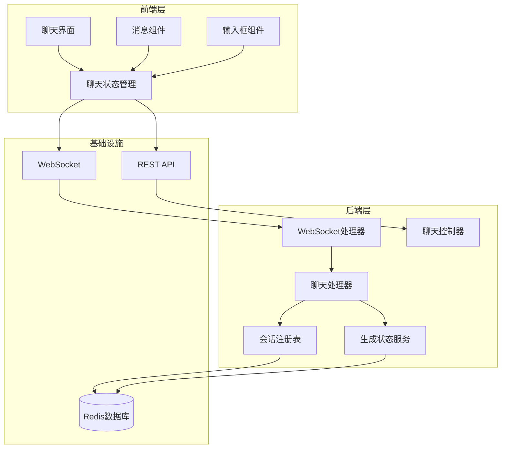
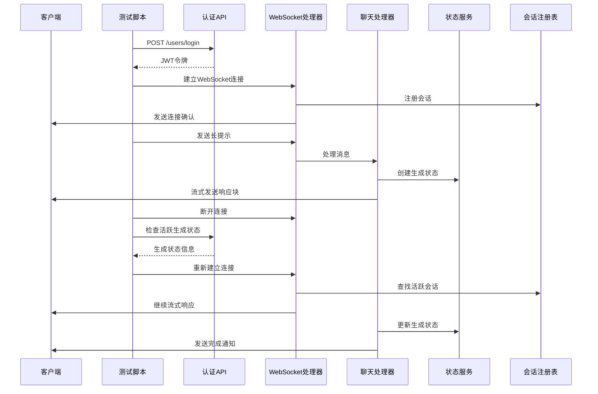
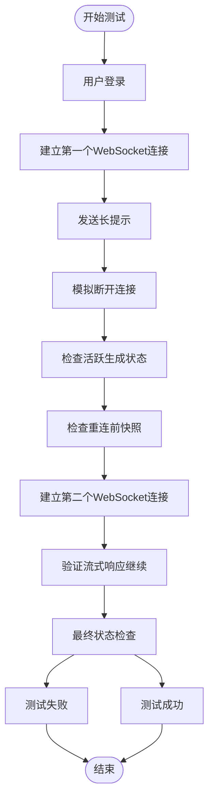
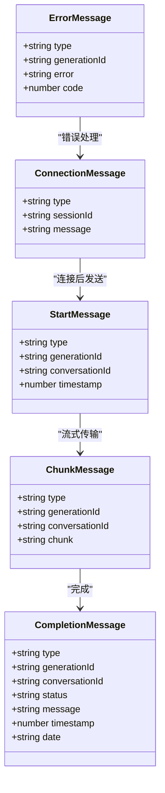
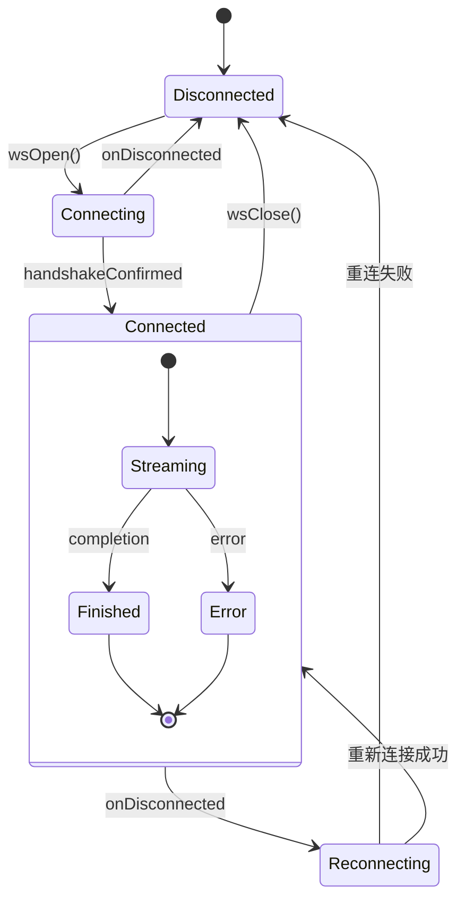
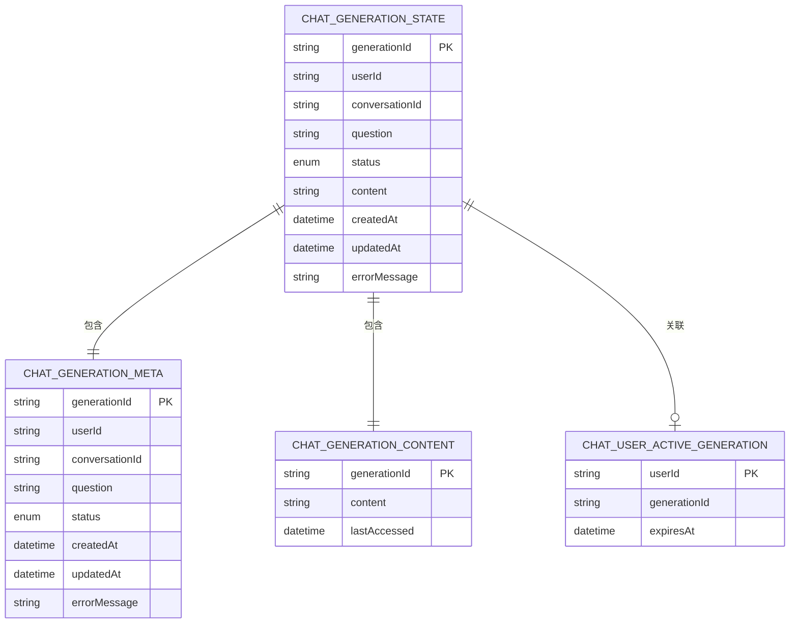
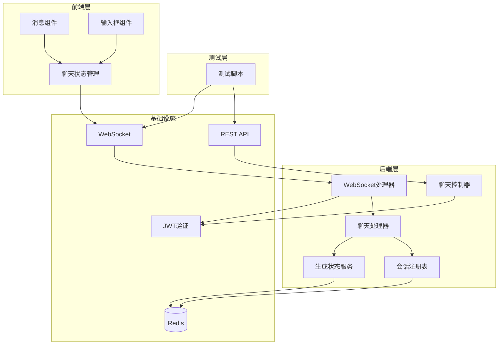

# 聊天重连冒烟测试

<cite>
**本文档引用的文件**
- [chat-reconnect-smoke-test.md](file://docs/chat-reconnect-smoke-test.md)
- [chat-reconnect-smoke-test.mjs](file://scripts/chat-reconnect-smoke-test.mjs)
- [ChatWebSocketHandler.java](file://src/main/java/com/yizhaoqi/smartpai/handler/ChatWebSocketHandler.java)
- [ChatHandler.java](file://src/main/java/com/yizhaoqi/smartpai/service/ChatHandler.java)
- [ChatController.java](file://src/main/java/com/yizhaoqi/smartpai/controller/ChatController.java)
- [ChatGenerationStateService.java](file://src/main/java/com/yizhaoqi/smartpai/service/ChatGenerationStateService.java)
- [ChatSessionRegistry.java](file://src/main/java/com/yizhaoqi/smartpai/service/ChatSessionRegistry.java)
- [WebSocketConfig.java](file://src/main/java/com/yizhaoqi/smartpai/config/WebSocketConfig.java)
- [index.ts](file://frontend/src/store/modules/chat/index.ts)
- [chat-message.vue](file://frontend/src/views/chat/modules/chat-message.vue)
- [input-box.vue](file://frontend/src/views/chat/modules/input-box.vue)
</cite>

## 目录
1. [简介](#简介)
2. [项目结构](#项目结构)
3. [核心组件](#核心组件)
4. [架构概览](#架构概览)
5. [详细组件分析](#详细组件分析)
6. [依赖关系分析](#依赖关系分析)
7. [性能考虑](#性能考虑)
8. [故障排除指南](#故障排除指南)
9. [结论](#结论)

## 简介

聊天重连冒烟测试是一个自动化测试脚本，专门用于验证派聪明聊天系统的WebSocket连接重连功能。该测试通过模拟用户断开连接的情况，验证系统在断线后能够正确恢复聊天会话，并确保生成状态的完整性和一致性。

该测试脚本提供了完整的端到端验证流程，包括用户认证、WebSocket连接建立、消息流式传输、断线模拟、状态检查、重新连接验证等功能。

## 项目结构

派聪明项目采用前后端分离的架构设计，主要包含以下关键组件：

**图表来源**
- [ChatWebSocketHandler.java:16-34](file://src/main/java/com/yizhaoqi/smartpai/handler/ChatWebSocketHandler.java#L16-L34)
- [ChatHandler.java:34-82](file://src/main/java/com/yizhaoqi/smartpai/service/ChatHandler.java#L34-L82)
- [ChatController.java:17-27](file://src/main/java/com/yizhaoqi/smartpai/controller/ChatController.java#L17-L27)

**章节来源**
- [chat-reconnect-smoke-test.md:1-77](file://docs/chat-reconnect-smoke-test.md#L1-L77)
- [chat-reconnect-smoke-test.mjs:1-360](file://scripts/chat-reconnect-smoke-test.mjs#L1-L360)

## 核心组件

### 测试脚本组件

测试脚本包含以下核心功能模块：

1. **配置管理** - 处理命令行参数和默认配置
2. **认证模块** - 用户登录和JWT令牌获取
3. **WebSocket通信** - 主连接和重连连接的管理
4. **状态检查** - 生成状态的实时监控
5. **断言验证** - 结果验证和错误处理

### 后端核心组件

后端系统包含以下关键组件：

1. **WebSocket处理器** - 处理WebSocket连接和消息路由
2. **聊天处理器** - 管理聊天会话和消息流式传输
3. **会话注册表** - 维护用户与WebSocket会话的映射关系
4. **生成状态服务** - 管理聊天生成状态的持久化
5. **聊天控制器** - 提供REST API接口

**章节来源**
- [ChatWebSocketHandler.java:16-181](file://src/main/java/com/yizhaoqi/smartpai/handler/ChatWebSocketHandler.java#L16-L181)
- [ChatHandler.java:34-704](file://src/main/java/com/yizhaoqi/smartpai/service/ChatHandler.java#L34-L704)
- [ChatGenerationStateService.java:17-267](file://src/main/java/com/yizhaoqi/smartpai/service/ChatGenerationStateService.java#L17-L267)

## 架构概览

派聪明聊天系统采用基于Spring Boot的微服务架构，结合WebSocket实现实时双向通信：

**图表来源**
- [chat-reconnect-smoke-test.mjs:270-354](file://scripts/chat-reconnect-smoke-test.mjs#L270-L354)
- [ChatWebSocketHandler.java:36-74](file://src/main/java/com/yizhaoqi/smartpai/handler/ChatWebSocketHandler.java#L36-L74)
- [ChatHandler.java:84-160](file://src/main/java/com/yizhaoqi/smartpai/service/ChatHandler.java#L84-L160)

## 详细组件分析

### 测试脚本执行流程

测试脚本按照严格的顺序执行以下步骤：

**图表来源**
- [chat-reconnect-smoke-test.mjs:270-354](file://scripts/chat-reconnect-smoke-test.mjs#L270-L354)

### WebSocket消息协议

系统使用标准化的消息协议进行WebSocket通信：

**图表来源**
- [ChatWebSocketHandler.java:62-73](file://src/main/java/com/yizhaoqi/smartpai/handler/ChatWebSocketHandler.java#L62-L73)
- [ChatHandler.java:454-496](file://src/main/java/com/yizhaoqi/smartpai/service/ChatHandler.java#L454-L496)

### 前端聊天状态管理

前端使用Vuex Store管理聊天状态，实现智能重连和状态同步：

**图表来源**
- [index.ts:309-319](file://frontend/src/store/modules/chat/index.ts#L309-L319)

**章节来源**
- [index.ts:1-342](file://frontend/src/store/modules/chat/index.ts#L1-L342)
- [input-box.vue:139-177](file://frontend/src/views/chat/modules/input-box.vue#L139-L177)

### 后端生成状态管理

后端使用Redis存储聊天生成状态，确保数据持久化和一致性：

**图表来源**
- [ChatGenerationStateService.java:235-267](file://src/main/java/com/yizhaoqi/smartpai/service/ChatGenerationStateService.java#L235-L267)

**章节来源**
- [ChatGenerationStateService.java:17-267](file://src/main/java/com/yizhaoqi/smartpai/service/ChatGenerationStateService.java#L17-L267)

## 依赖关系分析

系统各组件之间的依赖关系如下：

**图表来源**
- [WebSocketConfig.java:24-32](file://src/main/java/com/yizhaoqi/smartpai/config/WebSocketConfig.java#L24-L32)
- [ChatWebSocketHandler.java:30-34](file://src/main/java/com/yizhaoqi/smartpai/handler/ChatWebSocketHandler.java#L30-L34)

**章节来源**
- [WebSocketConfig.java:14-33](file://src/main/java/com/yizhaoqi/smartpai/config/WebSocketConfig.java#L14-L33)
- [ChatController.java:17-27](file://src/main/java/com/yizhaoqi/smartpai/controller/ChatController.java#L17-L27)

## 性能考虑

### WebSocket连接管理

系统采用高效的连接管理策略：

1. **连接池优化** - 使用ConcurrentHashMap维护用户会话映射
2. **内存管理** - 及时清理已完成的生成任务状态
3. **超时处理** - 自动检测和清理僵尸连接
4. **重连机制** - 指数退避算法避免过度重连

### 数据持久化策略

使用Redis实现高性能的数据持久化：

1. **TTL管理** - 自动过期机制减少内存占用
2. **分片存储** - 将元数据和内容分离存储
3. **批量操作** - 减少Redis网络往返次数
4. **缓存策略** - 智能缓存活跃会话状态

### 流式传输优化

消息流式传输采用以下优化策略：

1. **背压控制** - 监控客户端接收能力调整发送速率
2. **缓冲管理** - 合理的缓冲区大小避免内存溢出
3. **错误恢复** - 单个消息错误不影响整体传输
4. **心跳机制** - 保持连接活跃状态

## 故障排除指南

### 常见问题及解决方案

| 问题类型 | 症状 | 可能原因 | 解决方案 |
|---------|------|----------|----------|
| 认证失败 | 登录失败或401错误 | JWT令牌无效或过期 | 检查用户名密码，重新登录 |
| 连接超时 | WebSocket连接建立失败 | 网络问题或防火墙阻拦 | 检查网络连接，配置允许的源 |
| 重连失败 | 断线后无法恢复连接 | 会话状态丢失或过期 | 清理Redis缓存，重启服务 |
| 状态不一致 | 生成状态与实际不符 | 缓存不同步或并发冲突 | 检查Redis连接，增加重试机制 |
| 性能问题 | 响应延迟或内存泄漏 | 连接数过多或资源未释放 | 优化连接池配置，定期清理 |

### 调试工具和方法

1. **日志分析** - 检查后端日志中的错误信息
2. **网络监控** - 使用浏览器开发者工具查看WebSocket通信
3. **状态检查** - 通过REST API验证生成状态
4. **性能监控** - 监控Redis和WebSocket连接状态

**章节来源**
- [chat-reconnect-smoke-test.mjs:356-360](file://scripts/chat-reconnect-smoke-test.mjs#L356-L360)

## 结论

聊天重连冒烟测试为派聪明聊天系统提供了全面的功能验证框架。通过自动化测试，可以确保系统在各种网络条件下都能提供稳定可靠的聊天体验。

测试脚本的设计充分考虑了实际使用场景，包括网络不稳定、用户主动断开、服务重启等常见情况。后端架构采用Spring Boot和WebSocket技术栈，配合Redis实现高可用的状态管理。

未来可以进一步优化的方向包括：
1. 增加更多的边界条件测试
2. 实现更精细的性能指标监控
3. 扩展到多用户并发场景测试
4. 集成到CI/CD流水线中实现持续集成

该测试框架为系统的稳定运行提供了重要保障，确保用户能够在任何网络环境下都能获得流畅的聊天体验。