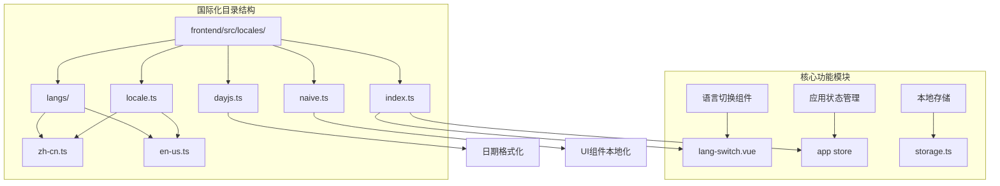
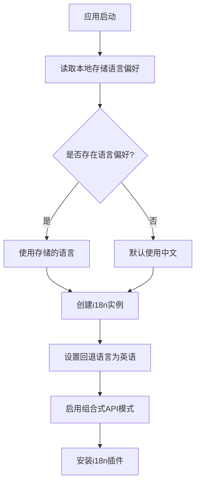
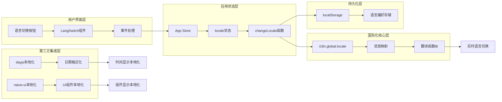
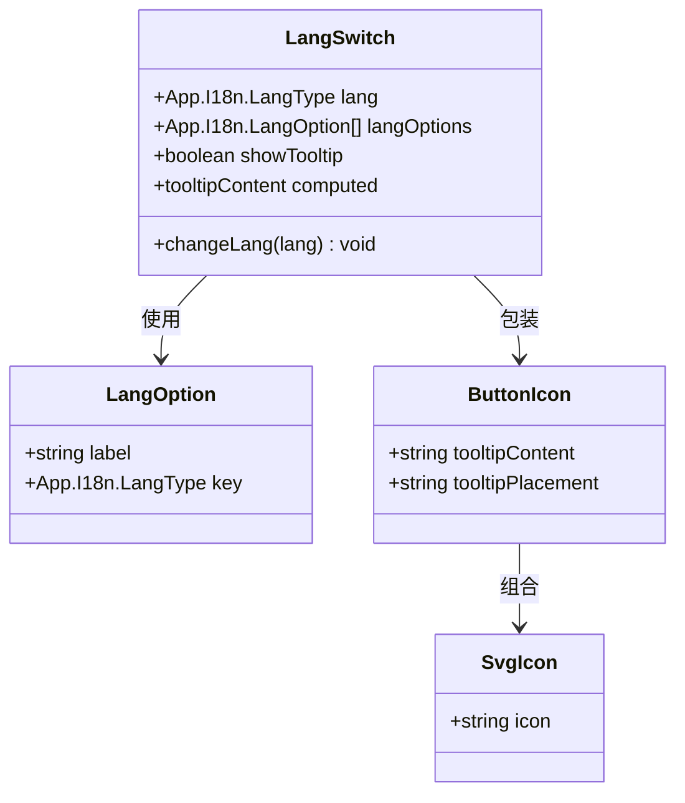
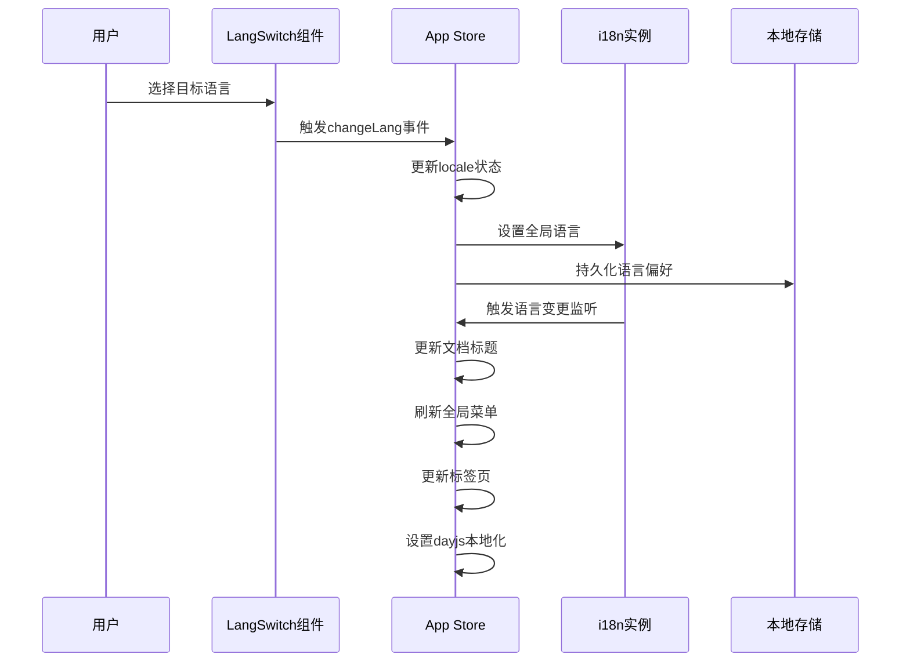
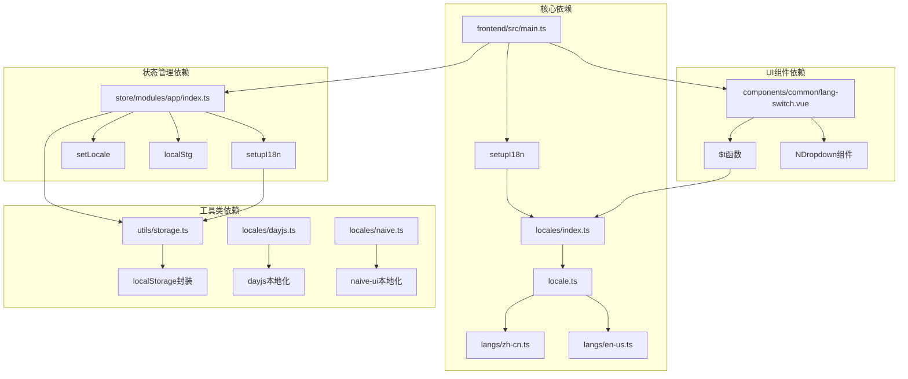

# 中文文档本地化

<cite>
**本文档引用的文件**
- [frontend/src/locales/index.ts](file://frontend/src/locales/index.ts)
- [frontend/src/locales/locale.ts](file://frontend/src/locales/locale.ts)
- [frontend/src/locales/langs/zh-cn.ts](file://frontend/src/locales/langs/zh-cn.ts)
- [frontend/src/locales/langs/en-us.ts](file://frontend/src/locales/langs/en-us.ts)
- [frontend/src/locales/dayjs.ts](file://frontend/src/locales/dayjs.ts)
- [frontend/src/locales/naive.ts](file://frontend/src/locales/naive.ts)
- [frontend/src/components/common/lang-switch.vue](file://frontend/src/components/common/lang-switch.vue)
- [frontend/src/utils/storage.ts](file://frontend/src/utils/storage.ts)
- [frontend/src/main.ts](file://frontend/src/main.ts)
- [frontend/src/store/modules/app/index.ts](file://frontend/src/store/modules/app/index.ts)
- [frontend/src/typings/app.d.ts](file://frontend/src/typings/app.d.ts)
</cite>

## 目录
1. [简介](#简介)
2. [项目结构](#项目结构)
3. [核心组件](#核心组件)
4. [架构概览](#架构概览)
5. [详细组件分析](#详细组件分析)
6. [依赖关系分析](#依赖关系分析)
7. [性能考虑](#性能考虑)
8. [故障排除指南](#故障排除指南)
9. [结论](#结论)

## 简介

PaiSmart 是一个基于 Vue 3 和 Spring Boot 的智能聊天应用，支持中英文双语本地化功能。本文档深入分析了项目的国际化（i18n）系统实现，包括语言切换机制、本地存储、路由集成以及第三方库的本地化配置。

该系统采用现代化的前端国际化解决方案，通过 vue-i18n 实现多语言支持，并集成了 dayjs 和 naive-ui 等第三方库的本地化功能。系统设计注重用户体验，提供了无缝的语言切换体验和持久化的语言偏好设置。

## 项目结构

前端国际化相关的文件主要集中在 `frontend/src/locales` 目录下，采用模块化的设计思路：



**图表来源**
- [frontend/src/locales/index.ts:1-27](file://frontend/src/locales/index.ts#L1-L27)
- [frontend/src/locales/locale.ts:1-10](file://frontend/src/locales/locale.ts#L1-L10)

**章节来源**
- [frontend/src/locales/index.ts:1-27](file://frontend/src/locales/index.ts#L1-L27)
- [frontend/src/locales/locale.ts:1-10](file://frontend/src/locales/locale.ts#L1-L10)

## 核心组件

### 国际化插件初始化

国际化系统的核心是 `index.ts` 文件中的 `setupI18n` 函数，它负责创建和配置 vue-i18n 实例：



**图表来源**
- [frontend/src/locales/index.ts:6-11](file://frontend/src/locales/index.ts#L6-L11)
- [frontend/src/utils/storage.ts](file://frontend/src/utils/storage.ts#L5)

### 语言包管理

系统支持两种语言：简体中文和英语，每种语言都有完整的翻译覆盖：

| 功能分类 | 中文翻译数量 | 英文翻译数量 | 差异说明 |
|---------|-------------|-------------|----------|
| 系统标题 | 1 | 1 | 完全对应 |
| 常用操作 | 40+ | 40+ | 功能完整 |
| 主题配置 | 80+ | 80+ | 配置项完整 |
| 路由名称 | 15+ | 15+ | 页面导航 |
| 登录表单 | 60+ | 60+ | 用户认证 |
| 表单验证 | 20+ | 20+ | 数据校验 |
| 下拉菜单 | 5+ | 5+ | 操作菜单 |
| 图标提示 | 15+ | 15+ | UI提示 |

**章节来源**
- [frontend/src/locales/langs/zh-cn.ts:1-282](file://frontend/src/locales/langs/zh-cn.ts#L1-L282)
- [frontend/src/locales/langs/en-us.ts:1-283](file://frontend/src/locales/langs/en-us.ts#L1-L283)

## 架构概览

国际化系统采用分层架构设计，确保语言切换的实时性和一致性：



**图表来源**
- [frontend/src/components/common/lang-switch.vue:34-36](file://frontend/src/components/common/lang-switch.vue#L34-L36)
- [frontend/src/store/modules/app/index.ts:68-72](file://frontend/src/store/modules/app/index.ts#L68-L72)
- [frontend/src/locales/index.ts:22-26](file://frontend/src/locales/index.ts#L22-L26)

## 详细组件分析

### 语言切换组件

`LangSwitch` 组件是用户界面层的核心组件，提供直观的语言选择功能：



**图表来源**
- [frontend/src/components/common/lang-switch.vue:9-26](file://frontend/src/components/common/lang-switch.vue#L9-L26)
- [frontend/src/typings/app.d.ts:500-517](file://frontend/src/typings/app.d.ts#L500-L517)

组件特性：
- 支持悬停触发的下拉菜单
- 显示当前语言的工具提示
- 响应式设计适配移动端
- 内置语言选项配置

**章节来源**
- [frontend/src/components/common/lang-switch.vue:1-50](file://frontend/src/components/common/lang-switch.vue#L1-L50)

### 应用状态管理

应用状态管理器负责协调整个国际化流程：



**图表来源**
- [frontend/src/store/modules/app/index.ts:68-85](file://frontend/src/store/modules/app/index.ts#L68-L85)
- [frontend/src/store/modules/app/index.ts:119-133](file://frontend/src/store/modules/app/index.ts#L119-L133)

**章节来源**
- [frontend/src/store/modules/app/index.ts:1-170](file://frontend/src/store/modules/app/index.ts#L1-L170)

### 第三方库本地化

系统集成了多个第三方库的本地化支持：

| 库名称 | 本地化功能 | 配置方式 |
|--------|------------|----------|
| dayjs | 日期格式化、时间显示 | 自动映射语言代码 |
| naive-ui | UI组件本地化 | 提供本地化语言包 |
| vue-i18n | 应用内翻译 | 消息映射配置 |

**章节来源**
- [frontend/src/locales/dayjs.ts:1-21](file://frontend/src/locales/dayjs.ts#L1-L21)
- [frontend/src/locales/naive.ts:1-13](file://frontend/src/locales/naive.ts#L1-L13)

## 依赖关系分析

国际化系统与其他模块的依赖关系如下：



**图表来源**
- [frontend/src/main.ts](file://frontend/src/main.ts#L7)
- [frontend/src/store/modules/app/index.ts:8-9](file://frontend/src/store/modules/app/index.ts#L8-L9)
- [frontend/src/components/common/lang-switch.vue](file://frontend/src/components/common/lang-switch.vue#L3)

**章节来源**
- [frontend/src/main.ts:1-34](file://frontend/src/main.ts#L1-L34)
- [frontend/src/utils/storage.ts:1-10](file://frontend/src/utils/storage.ts#L1-L10)

## 性能考虑

国际化系统的性能优化策略：

### 1. 懒加载机制
- 语言包按需加载，避免一次性加载所有语言资源
- 仅在用户切换语言时才进行语言包切换

### 2. 缓存策略
- 语言偏好存储在 localStorage 中，避免每次刷新重新配置
- 文档标题和菜单内容在语言切换时进行增量更新

### 3. 内存管理
- 使用 Pinia 状态管理，自动清理未使用的状态
- 合理的组件生命周期管理，避免内存泄漏

### 4. 渲染优化
- 使用 Vue 3 的响应式系统，精确控制组件更新范围
- 避免不必要的全页面重渲染

## 故障排除指南

### 常见问题及解决方案

| 问题类型 | 症状描述 | 可能原因 | 解决方案 |
|----------|----------|----------|----------|
| 语言切换无效 | 界面文字未改变 | i18n实例未正确设置 | 检查setLocale函数调用 |
| 本地存储失效 | 刷新后语言恢复默认 | localStorage访问失败 | 检查浏览器存储权限 |
| 第三方组件未本地化 | 日期或UI组件未本地化 | 本地化配置缺失 | 确认dayjs和naive-ui配置 |
| 翻译键缺失 | 显示原始键名 | 语言包不完整 | 检查对应语言包的翻译键 |

### 调试方法

1. **检查语言偏好存储**
   ```javascript
   // 在浏览器控制台检查
   console.log(localStorage.getItem('lang'));
   ```

2. **验证i18n实例状态**
   ```javascript
   // 检查当前语言设置
   console.log(i18n.global.locale.value);
   ```

3. **调试翻译函数**
   ```javascript
   // 测试翻译功能
   console.log($t('common.add'));
   ```

**章节来源**
- [frontend/src/utils/storage.ts](file://frontend/src/utils/storage.ts#L5)
- [frontend/src/locales/index.ts:24-26](file://frontend/src/locales/index.ts#L24-L26)

## 结论

PaiSmart 的国际化系统展现了现代前端应用的最佳实践：

### 设计优势
- **模块化架构**：清晰的职责分离和依赖管理
- **用户体验优先**：无缝的语言切换和持久化偏好
- **扩展性强**：易于添加新的语言支持和本地化功能
- **性能优化**：合理的懒加载和缓存策略

### 技术亮点
- 采用 vue-i18n 9.x 的组合式 API，提供更好的 TypeScript 支持
- 集成多个第三方库的本地化，确保整体体验的一致性
- 完善的状态管理和事件驱动架构
- 响应式设计适配多端设备

### 改进建议
- 可以考虑实现动态语言包加载，进一步提升性能
- 添加翻译覆盖率统计和质量检查机制
- 考虑实现语言包热重载功能，便于开发调试

该国际化系统为类似项目提供了优秀的参考模板，展示了如何构建一个健壮、可维护且用户友好的多语言应用。