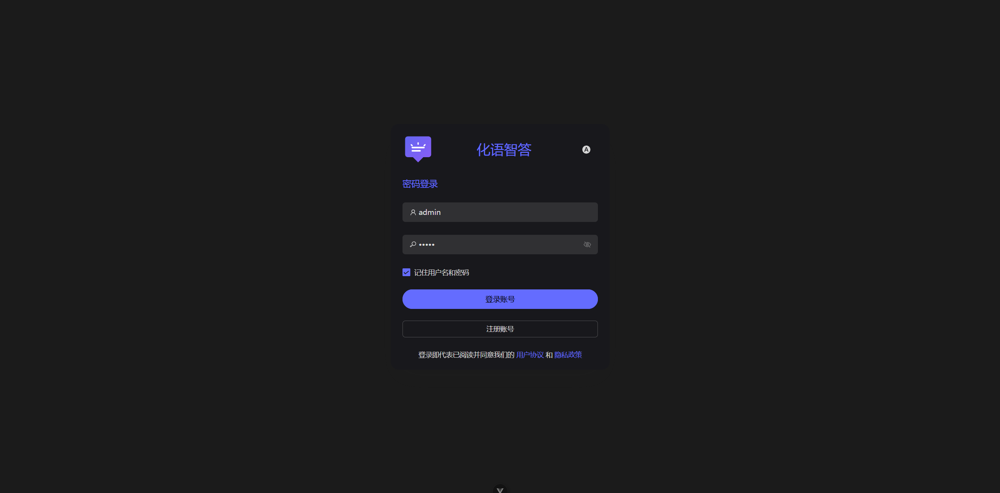
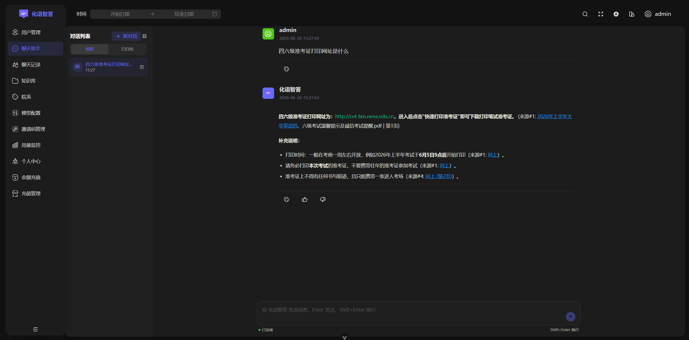
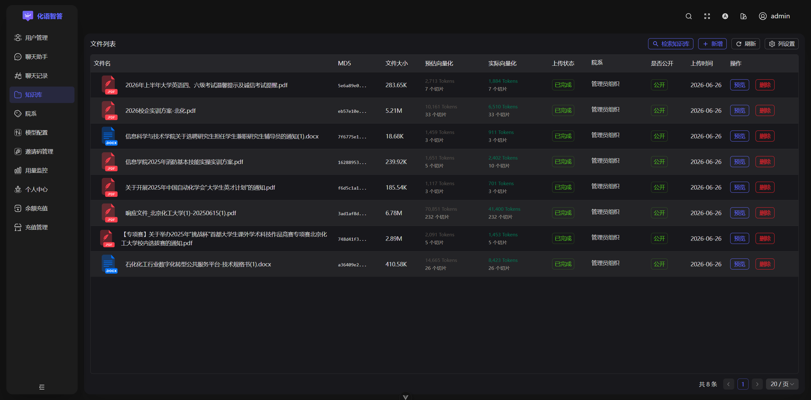

# 化语智答（HuaYuZhiDa）

面向高校师生的 RAG 智能问答系统，基于私有知识库与大语言模型构建，融合向量检索与语义理解，实现对教务通知、课程信息等非结构化数据的精准问答，支持多轮对话与实时流式响应。

## 技术栈

### 后端
- **框架**: Spring Boot 3.4.2 (Java 17)
- **数据库**: MySQL 8.0 + JPA/Hibernate
- **搜索引擎**: Elasticsearch 8.10 (IK 中文分词, 2048 维向量)
- **缓存**: Redis 7.0
- **消息队列**: Kafka 3.2+
- **对象存储**: MinIO 8.5
- **AI 服务**: DeepSeek API (LLM) + DashScope Embedding (向量化)
- **认证**: JWT + Spring Security

### 前端
- **框架**: Vue 3 + TypeScript
- **UI**: Naive UI
- **状态管理**: Pinia
- **构建工具**: Vite 6.3
- **CSS**: UnoCSS + SCSS

## 核心功能

### RAG 知识库
- 文档上传（支持 PDF、DOC、DOCX、TXT）
- 语义分块（HanLP 中文分词 + 滑动窗口重叠）
- 向量化存储（DashScope text-embedding-v4, 2048 维）
- 混合检索（KNN 向量相似度 + BM25 文本匹配）
- 权限过滤（院系级数据隔离）

### 智能问答
- ReAct 代理循环（最多 4 轮推理，8 次工具调用）
- 实时流式响应（WebSocket）
- 多轮对话管理
- 引用溯源（文件名 + 页码）

### 多租户
- 院系级数据隔离
- 三级访问控制（私有/院系/公开）
- 院系标签树形结构

### 用户管理
- 邀请码注册
- 角色权限（USER/ADMIN）
- Token 用量配额（日限额/余额两种模式）
- 微信支付充值

## 界面展示

### 登录页


### 对话界面


### 知识库管理


## 快速开始

### 环境要求
- Java 17+（推荐 23）
- Maven 3.8.6+
- Node.js 18.20.0+
- pnpm 8.7.0+
- MySQL 8.0
- Elasticsearch 8.10.0
- MinIO 8.5+
- Kafka 3.2+
- Redis 7.0+

### 配置
```bash
cp .env.example .env
# 编辑 .env 文件，填写以下必要配置：
#   - 数据库连接（SPRING_DATASOURCE_*）
#   - Redis 连接（SPRING_DATA_REDIS_*）
#   - DeepSeek API Key（DEEPSEEK_API_KEY）—— 对话功能必需
#   - DashScope API Key（EMBEDDING_API_KEY）—— 向量化功能必需
#   - MinIO / Kafka / ES 连接信息
```

### 一键启动（推荐）

双击 `run.cmd` 即可一键启动所有服务（Redis、MinIO、Elasticsearch、Kafka、后端、前端）。停止服务双击 `stop.cmd`。

> 需要将 Redis、MinIO、Elasticsearch、Kafka 安装在 `D:\tools\` 目录下，路径可在 `start-all.ps1` 中修改。

### 手动启动

```bash
# 后端
mvn spring-boot:run

# 前端
cd frontend
pnpm install
pnpm dev
```

访问 http://localhost:9527

## 项目结构

```
├── run.cmd / stop.cmd                  # 一键启动/停止脚本
├── start-all.ps1 / stop-all.ps1        # PowerShell 启动/停止逻辑
├── pom.xml                             # Maven 项目配置
├── infra.sh                            # 基础设施服务启停脚本
├── .env                                # 环境配置（API Key、数据库等）
├── src/main/java/com/huayu/smartqa/    # 后端代码
│   ├── config/                         # 配置类
│   ├── controller/                     # REST 控制器
│   ├── service/                        # 业务逻辑
│   ├── model/                          # JPA 实体
│   ├── entity/                         # ES 文档和 DTO
│   ├── repository/                     # 数据访问层
│   ├── consumer/                       # Kafka 消费者
│   ├── handler/                        # WebSocket 处理器
│   ├── client/                         # 外部 API 客户端
│   └── utils/                          # 工具类
├── frontend/                           # 前端代码
│   ├── src/
│   │   ├── views/                      # 页面组件
│   │   ├── components/                 # 公共组件
│   │   ├── store/                      # Pinia 状态管理
│   │   ├── service/                    # API 服务
│   │   ├── router/                     # 路由配置
│   │   └── locales/                    # 国际化
│   └── packages/                       # 工作区包
├── docs/                               # 文档和配置
└── pics/                               # 项目截图
```

## API 端点

### 认证
- `POST /api/v1/users/login` - 登录
- `POST /api/v1/users/register` - 注册
- `POST /api/v1/users/logout` - 登出

### 文档管理
- `POST /api/v1/upload/chunk` - 分片上传
- `POST /api/v1/upload/merge` - 合并文件
- `GET /api/v1/documents/accessible` - 获取可访问文档
- `DELETE /api/v1/documents/{fileMd5}` - 删除文档

### 智能问答
- `WebSocket /chat/{token}` - 实时对话
- `GET /api/v1/chat/generation/{generationId}` - 获取生成状态

### 搜索
- `GET /api/v1/search/hybrid` - 混合搜索

### 管理后台
- `GET /api/v1/admin/users` - 用户管理
- `CRUD /api/v1/admin/org-tags` - 院系管理
- `GET /api/v1/admin/usage/overview` - 用量统计

## 许可证

MIT License
